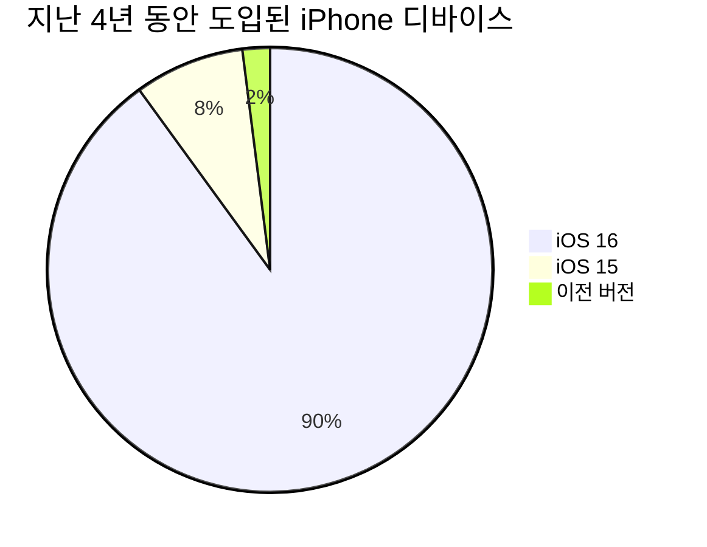
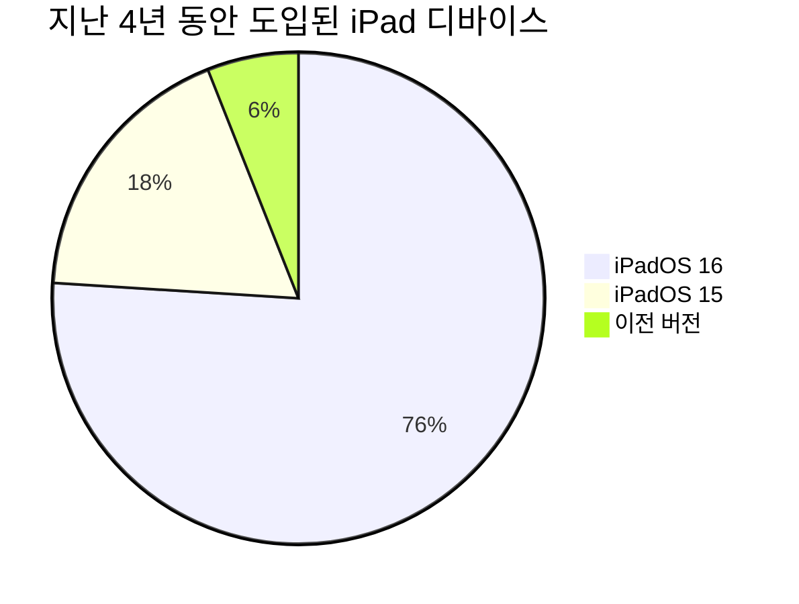

### 모바일 O/S 별 버전 점유율 확인해보자. (2023년)

### iOS 버전 점유율

**iPhone**

**iPad**

- 아이폰은 iOS 16이 압도적인 비율(90%)로 점유하고 있고, iOS 15가 8%, 그 이전 버전은 2% 차지
- 아이패드는 상대적으로 아이폰보다는 최신 OS 채택율이 낮음(76%)
- 폭 넓은 사용자층을 원한다면 **iOS15**까지! 그게 아니라면 큰 고민 없이 **iOS 16**까지 지원해도 무난해보임
- 해당 데이터는 2023년 5월 30일 기준임
- iOS 버전별 점유율 : [https://developer.apple.com/kr/support/app-store](https://developer.apple.com/support/app-store)

------

### android 버전 점유율

| 안드로이드 플랫폼 버전 | API 레벨 | 누적분포 |
| ---------------------- | :------: | -------: |
| 5.0 Lollipop           |    21    |    99.5% |
| 5.1 Lollipop           |    22    |    99.2% |
| 6.0 Marshmallow        |    23    |    97.7% |
| **7.0 Nougat**         |    24    |    95.4% |
| 7.1Nougat              |    25    |    93.9% |
| 8.0 Oreo               |    26    |    92.4% |
| 8.1 Oreo               |    27    |    90.2% |
| **9.0 Pie**            |    28    |    84.1% |
| 10 Q                   |    29    |    72.2% |
| 11 R                   |    30    |    54.4% |
| 12 S                   |    31    |    31.3% |
| 13 T                   |    33    |    15.0% |

- 안드로이드는 7.0 누가(API 레벨 24)가 95.4%를 지원
- 폭 넓은 사용자층을 원한다면 **7.0 Nougat (24)**까지! 얼리어답터를 위한 서비스라면 **9.0 Pie** 까지 지원해도 될 듯!
- 해당 데이터는 2023년 5월 30일 기준임
- [안드로이드 스튜디오](https://developer.android.com/studio/install?hl=ko)를 설치하고 새로운 프로젝트를 생성하면 버전 점유율 정보를 볼 수 있음